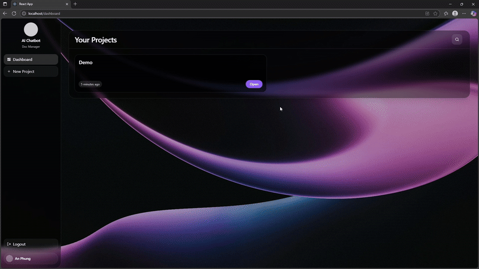

# DocuQuery
Upload files once, ask questions anytime.  
A simple Retrieval-Augmented Generation (RAG) app that lets you store documents and query their content with intelligent answers.

#### Built with


---
## Table of Contents

- [Overview](#overview)
- [Demo](#demo)
- [Getting Started](#getting-started)
- [Installation](#installation)
- [Usage](#usage)
- [Next Up](#next-up)

[//]: # (- [Testing]&#40;#testing&#41;)

---

## Overview
Knowledge is often locked inside static documents - PDFs, lecture notes, manuals, research papers. Searching through them manually is slow and frustrating.
This project is an end-to-end Retrieval-Augmented Generation (RAG) platform.  
It allows users to upload files, store them in **AWS S3** and **Postgres (Neon)**, process them into chunks and embeddings, and query them via **Pinecone** with answers grounded in source documents.

### Current Capabilities
- Upload and manage files through a **React Frontend**, backed by **FastAPI**
- **Nginx reverse proxy** with Docker Compose for unified access and deployment.
- **S3** integration for file storage, **Postgres** for metadata, **Pinecone** for vector search.
- Minimal RAG flow: *upload file → embed → query → answer*
- Works as a personal knowledge base for study notes, company docs, or research data.

---

## Demo
**Landing → Auth → Dashboard**

**Create Project → Upload File**

**Chat**


---


## Getting Started

### Prerequisites

Before you can run DocuQuery, make sure you have:

- **Programming Environment**
  - Python 3.10+
  - Node.js (>= 18) + npm
  - Docker & Docker Compose

- **Accounts & API Keys**
  - [OpenAI](https://platform.openai.com/) → `OPENAI_API_KEY`
  - [Pinecone](https://www.pinecone.io/) → `PINECONE_API_KEY`, `PINECONE_ENVIRONMENT`
  - [Neon Postgres](https://neon.tech/) → `DATABASE_URL`
  - [AWS S3](https://aws.amazon.com/s3/) → `AWS_ACCESS_KEY_ID`, `AWS_SECRET_ACCESS_KEY`, `AWS_S3_BUCKET`

- **Configuration**
  - Copy `.env.example` → `.env` and fill in the required values.
  - Example keys you must set:
    - `OPENAI_API_KEY`
    - `PINECONE_API_KEY` / `PINECONE_ENVIRONMENT`
    - `DATABASE_URL` (Neon Postgres connection string)
    - `AWS_ACCESS_KEY_ID` / `AWS_SECRET_ACCESS_KEY` / `AWS_S3_BUCKET`


---

## Installation

Clone repository:

```bash
git clone https://github.com/anthu2708/ragNote
cd ragNote
```

Copy environment variables and fill in your own credentials:

```bash
cp .env.example .env
```

Build the React frontend::

```bash
cd frontend
npm install
npm run build
cd ..
```

Start everything with Docker Compose:

```bash
docker compose up --build
```

Run database migrations:

```bash
docker compose exec backend alembic upgrade head
```

---

## Usage

### Start services
All services are routed through **Nginx** at [http://localhost](http://localhost).

- Frontend UI: [http://localhost:39](http://localhost)
- Backend API (FastAPI Swagger): [http://localhost/api](http://localhost/docs)

### Core Endpoints

#### Auth
- `POST /auth/register` - register new user
- `POST /auth/login` - login and receive tokens
- `GET /auth/me` - get current user profile

#### Chat
- `POST /chat/minimal` - create a chat
- `GET /chat/` - list all chats
- `DELETE /chat/{chat_id}` - delete a chat

#### File
- `POST /file/presign-by-key` - generate presigned upload URL (S3)
- `POST /file/confirm` - confirm upload
- `POST /file/ingest/{file_id}` - start ingestion (chunk + embed)
- `DELETE /file/delete/{file_id}` - delete file

#### Message
- `POST /message/send` - send a message
- `GET /message/{chat_id}` - fetch messages of a chat

#### AI
- `POST /ai/ask` - query uploaded files with RAG


[//]: # (---)

[//]: # ()
[//]: # (## Testing)

[//]: # ()
[//]: # (This is a student personal project.  )

[//]: # (Currently, testing is minimal and focuses on core endpoints.)

[//]: # ()
[//]: # (Run backend tests:)

[//]: # (```bash)

[//]: # (docker compose exec backend pytest)

[//]: # (```)

[//]: # (Run frontend tests:)

[//]: # (```bash)

[//]: # (docker compose exec frontend npm test)

[//]: # (```)

---

## Next Up

- **Background ingestion (async)**: Redis, idempotency, retry with backoff, progress reporting via `/ingest/{file_id}/status`.
- **Storage tab**: list with pagination, download (presigned GET), re-ingest, delete (garbage collect S3 + Pinecone + DB).
- **Evaluation (minimal)**: 20 QA pairs + script to export CSV (precision@k, faithfulness, relevancy).
- **Auth & limits**:  per-user daily quota, rate-limit (user/IP).
- **Caching & metrics**: Redis for embeddings/retrieve/answers; `/metrics` (Prometheus) with p95 latency tracking.
- **CI/CD**: GitHub Actions build → deploy
- **Docs**: export `/openapi.json`, add a “How it works” architecture diagram, 2-minute demo video